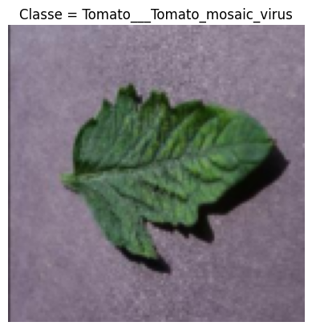
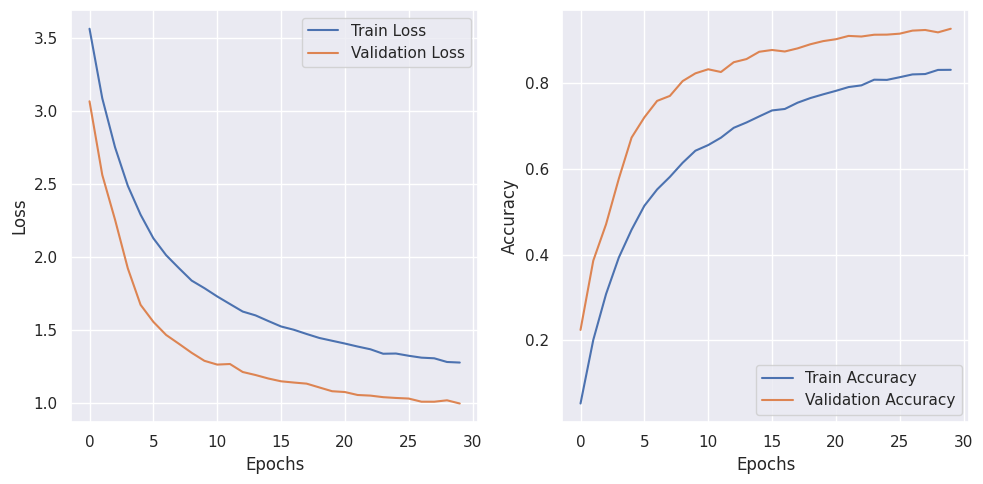
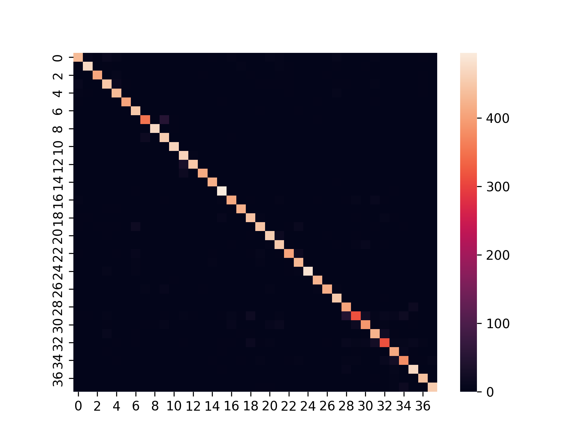
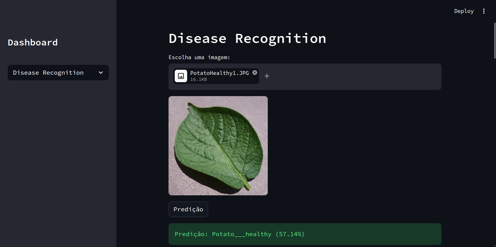
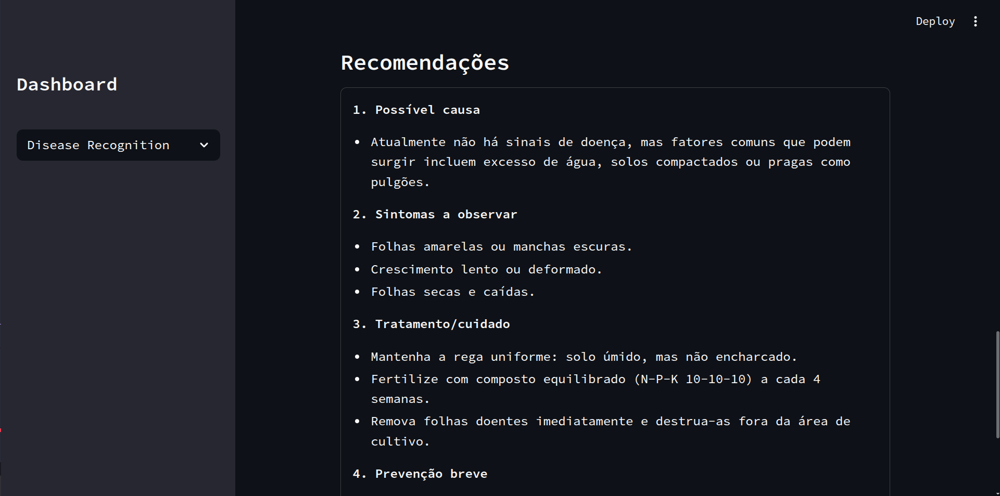

# Plant disease classifier

Neste projeto, o intuito foi criar um classificador usando redes neurais e aprendizado profundo para identificar a partir da folha da planta a presença e o tipo de doença associado. 

## Dataset

Dataset obtido a partir de: https://www.kaggle.com/datasets/vipoooool/new-plant-diseases-dataset. Contém cerca de 87k de imagens RGB de polantas saudáveis e doentes categorizadas em 38 classes distintas. 

</img>

## Modelo

Utilização de um modelo convolucional com 4 camadas convolucionais, cada uma contendo 2 convoluções seguidos de um `MaxPool`. O classificador é uma rede `MLP` com duas camadas ocultas e presença de Dropout para melhorar a robustez da rede contra overfitting.

## Treinamento

Resultados mais detalhados sobre métricas de F1-Score, Precisão e Recall para cada classe estão disponíveis no arquivo: `scripts/classification_report.txt`.

Histórico da função de perda e das acurácias de treino e validação:

</img>

Matriz de confusão:

</img>

## Sistema

A fim de ser mais amigável com o usuário, desenvolvi também uma interface com o `streamlit`, onde você pode submeter a imagem que deseja analisar, e o sistema retorna qual classe mais provável, além de quais partes na imagem são mais relevantes para a predição, conjuntamente a um texto retornado por uma LLM dando detalhes maiores.

</img>
</img>

-----

## Tecnologias

- **PyTorch**
    - Obtenção do modelo de aprendizado profundo para fazer a classificação das imagens.
- **Scikit-Learn**
    - Utilização de algumas funções prontas para calcular métricas de aprendizado de máquina, bem como para gerar a Matriz de Confusão.
- **MLFlow**
    - Utilização do MLFlow para gerenciar os experimentos, variando parâmetros tais como fração do dataset utilizado, batch size, taxa de aprendizado e outros.
- **Streamlit**
    - Utilizado para fazer uma interface de forma rápida e simples, mas bem funcional.
- **Groq**
    - A LLM utilizada para gerar recomendações foi o Groq, o qual disponibiliza de forma gratuita diversos modelos e tokens para os usuários.

## Como utilizar o projeto ?

Para facilitar a utilização do projeto, você pode acessar o mesmo pelo deploy que fiz em: https://plant-disease-classification-ctg64ksabczzss8v4nsjww.streamlit.app/.